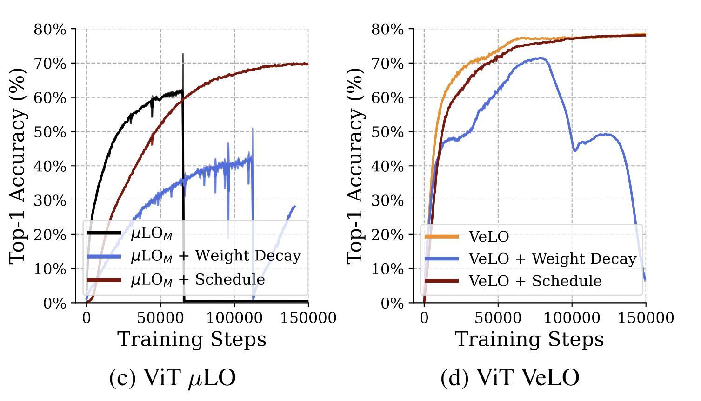

# Training Vision Transformers with PyLO Optimizers

This examples demonstrates training Vision Transformers (ViTs) using learned optimizers (VeLO and MuLO) and compares them against traditional optimizers like AdamW.

## Install Environment

```bash
pip install -r requirements.txt
```

## Download Datasets

### ImageNet (Full Dataset)
For the full ImageNet dataset, you'll need to download it from the official source and organize it in the standard format:
```bash
mkdir -p data/imagenet
# Download and extract ImageNet to data/imagenet/
# Ensure the structure is: data/imagenet/train/ and data/imagenet/val/
export PYLO_DATA_DIR=$PWD/data
```

### Imagenette (10-class subset of ImageNet)
```bash
mkdir -p data/imagenette
cd data/imagenette
wget https://s3.amazonaws.com/fast-ai-imageclas/imagenette2.tgz
tar -xvf imagenette2.tgz
cd ../..
export PYLO_DATA_DIR=$PWD/data
```

### Imagewoof (10-class dog breeds from ImageNet)
```bash
mkdir -p data/imagewoof
cd data/imagewoof
wget https://s3.amazonaws.com/fast-ai-imageclas/imagewoof2.tgz
tar -xvf imagewoof2.tgz
cd ../..
export PYLO_DATA_DIR=$PWD/data
```


## Quick Start: Train Vision Transformer (Base-16) on ImageNet

| Optimizer         | ViT Acc. ↑ (86M) |
|-------------------|------------------|
| $\mu$LO$_M$       | 62.14            |
| VeLO              | **78.39**         |
| AdamW + Cosine    | 77.22             |

### VeLO [https://arxiv.org/abs/2211.09760](https://arxiv.org/abs/2211.09760)
```bash
torchrun --nproc_per_node=4 train.py \
    --model vit_base_patch16_224 \
    --data-dir $PYLO_DATA_DIR/imagenet \
    --dataset imagenet \
    --experiment velo_vit_base_imagenet \
    --batch-size 64 \
    --epochs 300 \
    --workers 8 \
    --opt velo \
    --lr 1.0 \
    --sched none \
    --warmup-epochs 10 \
    --img-size 224 \
    --crop-pct 0.95 \
    --smoothing 0.0 \
    --clip-grad 1.0 \
    --mixup 0.1 \
    --cutmix 1.0 \
    --aa "rand-m7-mstd0.5" \
    --drop 0.1 \
    --drop-path 0.1 \
    --weight-decay 0.0 \
    --aug-repeats 4 \
    --hflip 0.5 \
    --seed 42 \
    --log-wandb \
    --wandb-project "pylo_examples" \
    --grad-accum-steps 2 \
    --amp \
    --torchcompile inductor
```

### MuLO [https://arxiv.org/abs/2406.00153](https://arxiv.org/abs/2406.00153)
```bash
torchrun --nproc_per_node=4 train.py \
    --model vit_base_patch16_224 \
    --data-dir $PYLO_DATA_DIR/imagenet \
    --dataset imagenet \
    --experiment mulo_vit_base_imagenet \
    --batch-size 64 \
    --epochs 300 \
    --workers 8 \
    --opt mulo \
    --lr 1.0 \
    --sched none \
    --warmup-epochs 10 \
    --img-size 224 \
    --crop-pct 0.95 \
    --smoothing 0.0 \
    --clip-grad 1.0 \
    --mixup 0.1 \
    --cutmix 1.0 \
    --aa "rand-m7-mstd0.5" 
    --drop 0.1 \
    --drop-path 0.1 \
    --weight-decay 0.0 \
    --aug-repeats 4 \
    --hflip 0.5 \
    --seed 42 \
    --log-wandb \
    --wandb-project "pylo_examples" \
    --grad-accum-steps 2 \
    --amp \
    --torchcompile inductor
```

### AdamW + Cosine Annealing
```bash
torchrun --nproc_per_node=4 train.py \
    --model vit_base_patch16_224 \
    --data-dir $PYLO_DATA_DIR/imagenet \
    --dataset imagenet \
    --experiment adamw_vit_base_imagenet \
    --batch-size 64 \
    --epochs 300 \
    --workers 8 \
    --opt adamw \
    --lr 1e-3 \
    --sched cosine \
    --warmup-epochs 10 \
    --img-size 224 \
    --crop-pct 0.95 \
    --smoothing 0.0 \
    --clip-grad 1.0 \
    --mixup 0.1 \
    --cutmix 1.0 \
    --aa "rand-m7-mstd0.5" \
    --drop 0.1 \
    --drop-path 0.1 \
    --weight-decay 0.05 \
    --aug-repeats 4 \
    --hflip 0.5 \
    --seed 42 \
    --log-wandb \
    --wandb-project "pylo_examples" \
    --grad-accum-steps 2 \
    --amp \
    --torchcompile inductor
```


## Quick Start: Train Vision Transformer (Base-16) on Imagenette


### VeLO  [https://arxiv.org/abs/2211.09760](https://arxiv.org/abs/2211.09760)
```bash
torchrun --nproc_per_node=4 train.py \
    --model vit_small_patch16_224 \
    --data-dir $PYLO_DATA_DIR/imagenette \
    --dataset imagenette \
    --experiment velo_vit_base_imagenette \
    --batch-size 32 \
    --epochs 100 \
    --workers 4 \
    --opt velo \
    --lr 1.0 \
    --sched none \
    --warmup-epochs 5 \
    --img-size 224 \
    --crop-pct 0.95 \
    --smoothing 0.0 \
    --clip-grad 1.0 \
    --mixup 0.1 \
    --cutmix 1.0 \
    --aa "rand-m7-mstd0.5" \
    --drop 0.1 \
    --drop-path 0.1 \
    --weight-decay 0.0 \
    --aug-repeats 4 \
    --hflip 0.5 \
    --seed 42 \
    --log-wandb \
    --wandb-project "pylo_examples" \
    --grad-accum-steps 1 \
    --amp \
    --torchcompile inductor
```

### MuLO [https://arxiv.org/abs/2406.00153](https://arxiv.org/abs/2406.00153)
```bash
torchrun --nproc_per_node=4 train.py \
    --model vit_base_patch16_224 \
    --data-dir $PYLO_DATA_DIR/imagenette \
    --dataset imagenette \
    --experiment mulo_vit_base_imagenette \
    --batch-size 32 \
    --epochs 100 \
    --workers 4 \
    --opt mulo \
    --lr 1.0 \
    --sched none \
    --warmup-epochs 5 \
    --img-size 224 \
    --crop-pct 0.95 \
    --smoothing 0.0 \
    --clip-grad 1.0 \
    --mixup 0.1 \
    --cutmix 1.0 \
    --aa "rand-m7-mstd0.5" \
    --drop 0.1 \
    --drop-path 0.1 \
    --weight-decay 0.0 \
    --aug-repeats 4 \
    --hflip 0.5 \
    --seed 42 \
    --log-wandb \
    --wandb-project "pylo_examples" \
    --grad-accum-steps 1 \
    --amp \
    --torchcompile inductor
```

### AdamW + Cosine Annealing (Baseline)
```bash
torchrun --nproc_per_node=4 train.py \
    --model vit_base_patch16_224 \
    --data-dir $PYLO_DATA_DIR/imagenette \
    --dataset imagenette \
    --experiment adamw_vit_base_imagenette \
    --batch-size 32 \
    --epochs 100 \
    --workers 4 \
    --opt adamw \
    --lr 1e-3 \
    --sched cosine \
    --warmup-epochs 5 \
    --img-size 224 \
    --crop-pct 0.95 \
    --smoothing 0.0 \
    --clip-grad 1.0 \
    --mixup 0.1 \
    --cutmix 1.0 \
    --aa "rand-m7-mstd0.5" \
    --drop 0.1 \
    --drop-path 0.1 \
    --weight-decay 0.05 \
    --aug-repeats 4 \
    --hflip 0.5 \
    --seed 42 \
    --log-wandb \
    --wandb-project "pylo_examples" \
    --grad-accum-steps 1 \
    --amp \
    --torchcompile inductor
```

## Quick Start: Train Vision Transformer (Base-16) on Imagewoof

### VeLO [https://arxiv.org/abs/2211.09760](https://arxiv.org/abs/2211.09760)
```bash
torchrun --nproc_per_node=4 train.py \
    --model vit_base_patch16_224 \
    --data-dir $PYLO_DATA_DIR/imagewoof \
    --dataset imagewoof \
    --experiment velo_vit_base_imagewoof \
    --batch-size 32 \
    --epochs 100 \
    --workers 4 \
    --opt velo \
    --lr 1.0 \
    --sched none \
    --warmup-epochs 5 \
    --img-size 224 \
    --crop-pct 0.95 \
    --smoothing 0.0 \
    --clip-grad 1.0 \
    --mixup 0.1 \
    --cutmix 1.0 \
    --aa "rand-m7-mstd0.5" \
    --drop 0.1 \
    --drop-path 0.1 \
    --weight-decay 0.0 \
    --aug-repeats 4 \
    --hflip 0.5 \
    --seed 42 \
    --log-wandb \
    --wandb-project "pylo_examples" \
    --grad-accum-steps 1 \
    --amp \
    --torchcompile inductor
```

### MuLO [https://arxiv.org/abs/2406.00153](https://arxiv.org/abs/2406.00153)
```bash
torchrun --nproc_per_node=4 train.py \
    --model vit_base_patch16_224 \
    --data-dir $PYLO_DATA_DIR/imagewoof \
    --dataset imagewoof \
    --experiment mulo_vit_base_imagewoof \
    --batch-size 32 \
    --epochs 100 \
    --workers 4 \
    --opt mulo \
    --lr 1.0 \
    --sched none \
    --warmup-epochs 5 \
    --img-size 224 \
    --crop-pct 0.95 \
    --smoothing 0.0 \
    --clip-grad 1.0 \
    --mixup 0.1 \
    --cutmix 1.0 \
    --aa "rand-m7-mstd0.5" \
    --drop 0.1 \
    --drop-path 0.1 \
    --weight-decay 0.0 \
    --aug-repeats 4 \
    --hflip 0.5 \
    --seed 42 \
    --log-wandb \
    --wandb-project "pylo_examples" \
    --grad-accum-steps 1 \
    --amp \
    --torchcompile inductor
```

### AdamW + Cosine Annealing
```bash
torchrun --nproc_per_node=4 train.py \
    --model vit_base_patch16_224 \
    --data-dir $PYLO_DATA_DIR/imagewoof \
    --dataset imagewoof \
    --experiment adamw_vit_base_imagewoof \
    --batch-size 32 \
    --epochs 100 \
    --workers 4 \
    --opt adamw \
    --lr 1e-3 \
    --sched cosine \
    --warmup-epochs 5 \
    --img-size 224 \
    --crop-pct 0.95 \
    --smoothing 0.0 \
    --clip-grad 1.0 \
    --mixup 0.1 \
    --cutmix 1.0 \
    --aa "rand-m7-mstd0.5" \
    --drop 0.1 \
    --drop-path 0.1 \
    --weight-decay 0.05 \
    --aug-repeats 4 \
    --hflip 0.5 \
    --seed 42 \
    --log-wandb \
    --wandb-project "pylo_examples" \
    --grad-accum-steps 1 \
    --amp \
    --torchcompile inductor
```


## Supported Datasets
- **imagenette**: 10-class subset of ImageNet (easy classes)
- **imagewoof**: 10-class subset of ImageNet (dog breeds, harder)
- **imagenet**: Full ImageNet-1K dataset (1000 classes)

## Supported Models
- **vit_tiny_patch16_224**: Tiny Vision Transformer
- **vit_small_patch16_224**: Small Vision Transformer 
- **vit_base_patch16_224**: Base Vision Transformer (default)
- **vit_large_patch16_224**: Large Vision Transformer

## Supported Optimizers
- **velo**: VeLO (Vectorized Learned Optimizer)
- **mulo**: MuLO (μ-Parameterized Learned Optimizer)
- **adamw**: AdamW with optional cosine annealing
- **sgd**: SGD with momentum

# Adding a schedule and Weight Decay to MuLO or VeLO




## Training a ViT base 16 with VeLO + schedule [https://arxiv.org/abs/2211.09760](https://arxiv.org/abs/2211.09760)
```bash
torchrun --nproc_per_node=4 train.py \
    --model vit_base_patch16_224 \
    --data-dir $PYLO_DATA_DIR/imagenet \
    --dataset imagenet \
    --experiment velo_vit_base_imagenet \
    --batch-size 64 \
    --epochs 300 \
    --workers 8 \
    --opt velo \
    --lr 1.0 \
    --sched cosine \
    --warmup-epochs 10 \
    --img-size 224 \
    --crop-pct 0.95 \
    --smoothing 0.0 \
    --clip-grad 1.0 \
    --mixup 0.1 \
    --cutmix 1.0 \
    --aa "rand-m7-mstd0.5" \
    --drop 0.1 \
    --drop-path 0.1 \
    --weight-decay 0.0 \
    --aug-repeats 4 \
    --hflip 0.5 \
    --seed 42 \
    --log-wandb \
    --wandb-project "pylo_examples" \
    --grad-accum-steps 2 \
    --amp \
    --torchcompile inductor
```


## Training a ViT base 16 with MuLO + schedule + WD [https://arxiv.org/abs/2406.00153](https://arxiv.org/abs/2406.00153)
```bash
torchrun --nproc_per_node=4 train.py \
    --model vit_base_patch16_224 \
    --data-dir $PYLO_DATA_DIR/imagenet \
    --dataset imagenet \
    --experiment mulo_vit_base_imagenet \
    --batch-size 64 \
    --epochs 300 \
    --workers 8 \
    --opt mulo \
    --lr 1.0 \
    --sched cosine \
    --warmup-epochs 10 \
    --img-size 224 \
    --crop-pct 0.95 \
    --smoothing 0.0 \
    --clip-grad 1.0 \
    --mixup 0.1 \
    --cutmix 1.0 \
    --aa "rand-m7-mstd0.5" \
    --drop 0.1 \
    --drop-path 0.1 \
    --weight-decay 0.01 \
    --aug-repeats 4 \
    --hflip 0.5 \
    --seed 42 \
    --log-wandb \
    --wandb-project "pylo_examples" \
    --grad-accum-steps 2 \
    --amp \
    --torchcompile inductor
```
