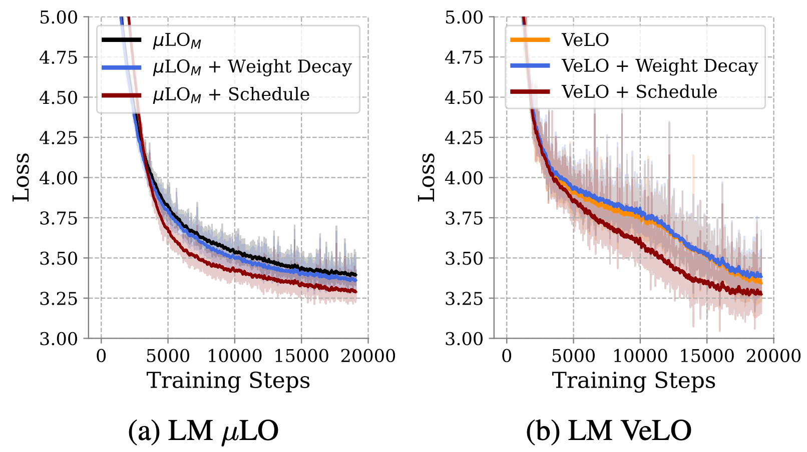

# Language Model Pre-training Instructions


# Quick Setup
```

# install environment
pip install -r requirements.txt


# download data
export PYLO_DATA_DIR=$PWD/data
mkdir $PYLO_DATA_DIR
python tools/download_dataset.py --output_dir $PYLO_DATA_DIR

```

# Quick Start: Train a 410M parameter Language model with MuLO or VeLO and replicate our results table

| Optimizer         | LM Loss ↓ (355M) |
|-------------------|------------------|
| $\mu$LO$_M$       | 3.18             |
| VeLO              | **2.89**         |
| AdamW + Cosine    | 2.91             |


```
#VeLO
CUDA_VISIBLE_DEVICES=0,1,2,3,4,5,6,7 torchrun --nproc_per_node=8 \
train.py \
--config 'config' \
--override optimizer_name VeLO \
model_name gpt2_410m_w1024_d24_h16 \
init_lr 1.0 \
compile True \
gas 8 \
batch_size 8 \
suffix "_10B_tokens_FINAL_qkv" \
iters_max 19073 \
use_lr_scheduler False \
use_mixed_precision True \
OPTIM.max_grad_norm 1.0 \
MODEL.GPT2.attn_type 'separate_kqv' \
seed $1

#MuLO
CUDA_VISIBLE_DEVICES=0,1,2,3,4,5,6,7 torchrun --nproc_per_node=8 \
train.py \
--config 'config' \
--override optimizer_name MuLO_cuda \
model_name gpt2_410m_w1024_d24_h16 \
init_lr 1.0 \
compile True \
gas 8 \
batch_size 8 \
suffix "_10B_tokens_FINAL_qkv" \
iters_max 19073 \
use_lr_scheduler False \
use_mixed_precision True \
OPTIM.max_grad_norm 1.0 \
MODEL.GPT2.attn_type 'separate_kqv' \
seed $1

#AdamW
CUDA_VISIBLE_DEVICES=0,1,2,3,4,5,6,7 torchrun --nproc_per_node=8 \
train.py \
--config 'config' \
--override optimizer_name AdamW \
model_name gpt2_410m_w1024_d24_h16 \
init_lr 0.001 \
compile True \
gas 8 \
batch_size 8 \
suffix "_10B_tokens_adamw_cosine_FINAL_qkv" \
iters_max 19073 \
use_lr_scheduler True \
warmup_ratio 0.02 \
use_mixed_precision True \
MODEL.GPT2.attn_type 'separate_kqv' \
seed $1
```


# Adding a schedule and Weight Decay to MuLO or VeLO




## Training a GPT model with VeLO + schedule [https://arxiv.org/abs/2211.09760](https://arxiv.org/abs/2211.09760)
```
CUDA_VISIBLE_DEVICES=0,1,2,3,4,5,6,7 torchrun --nproc_per_node=8 \
train.py \
--config 'config' \
--override optimizer_name MuLO_cuda \
model_name gpt2_small \
init_lr 1.0 \
compile True \
gas 2 \
batch_size 32 \
suffix "_10B_tokens_FINAL_qkv_sched_wd_0.0001" \
iters_max 19073 \
use_lr_scheduler False \
use_mixed_precision True \
MODEL.GPT2.attn_type 'separate_kqv' \
OPTIM.max_grad_norm 1.0 \
seed 42
```


## Training a 125M parameter LM MuLO + schedule + WD [https://arxiv.org/abs/2406.00153](https://arxiv.org/abs/2406.00153)
```
CUDA_VISIBLE_DEVICES=0,1,2,3,4,5,6,7 torchrun --nproc_per_node=8 \
train.py \
--config 'config' \
--override optimizer_name MuLO_cuda \
model_name gpt2_small \
init_lr 1.0 \
compile True \
gas 2 \
batch_size 32 \
suffix "_10B_tokens_FINAL_qkv_sched_wd_0.0001" \
iters_max 19073 \
use_lr_scheduler True \
use_mixed_precision True \
MODEL.GPT2.attn_type 'separate_kqv' \
OPTIM.weight_decay 0.0001 \
OPTIM.max_grad_norm 1.0 \
seed 42
```


### Data Processing

All experiments were conducted using the FinWeb-Edu dataset with a context length of 1024 tokens and a batch size of 32 per GPU. The model architecture is a standard decoder-only transformer with 12 layers, 12 attention heads, and an embedding dimension of 768.


# Slower Custom Setup


# Dataset Preprocessing

The dataset used for training is the FinWeb-Edu dataset. For convenience, we provide a script to preprocess the dataset from [Andrej Karpathy's build-NanoGPT](https://github.com/karpathy/build-nanogpt/blob/master/fineweb.py).

```
python fineweb.py --remote_name finweb_edu --local_name finweb_edu
```

This will download the dataset and save it in the `data` directory.

